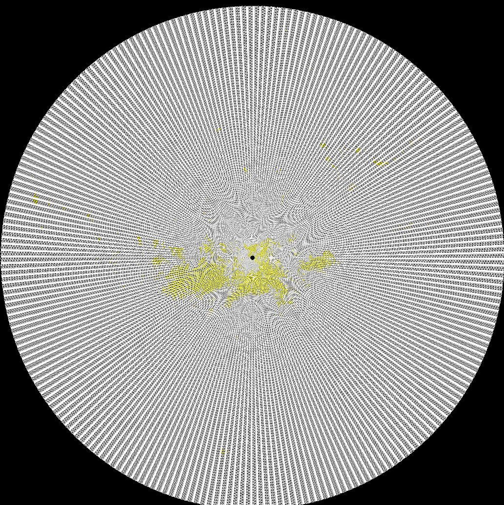
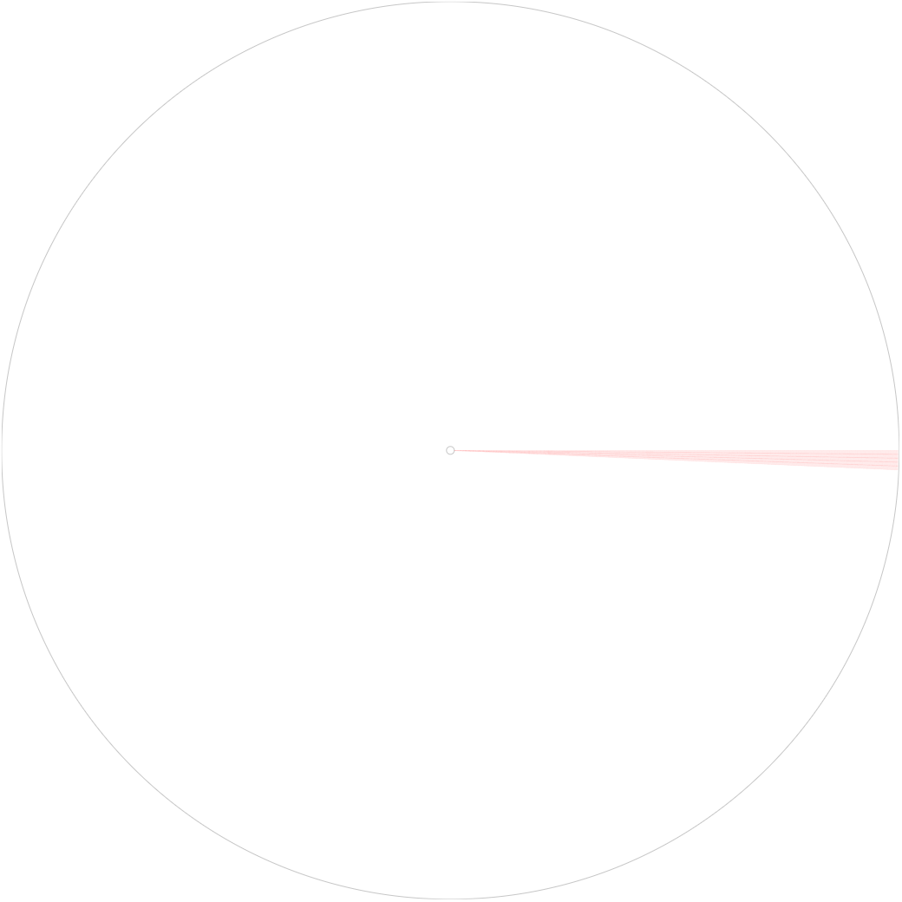

## About
WebGL project to render a large volume of Radar data using WebGL rendering

[GLSL Demo](http://amitukind.com/projects/webgl-radar-rendering/pureglsl/) [SVG Demo](http://amitukind.com/projects/webgl-radar-rendering/)

 Below are screenshots from  [GLSL Demo](http://amitukind.com/projects/webgl-radar-rendering/pureglsl/) and [SVG Demo](http://amitukind.com/projects/webgl-radar-rendering/)
 
 
 
 

## Author
[@amitukind](https://github.com/amitukind/) | [Website](http://amitukind.com/) | [amitverma.ukind@gmail.com](mailto:amitverma.ukind@gmail.com)
